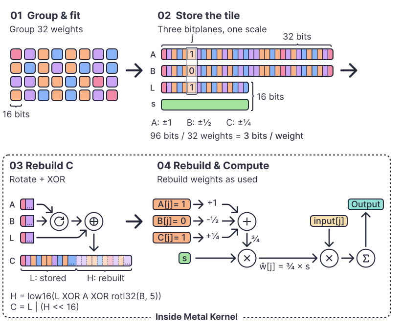
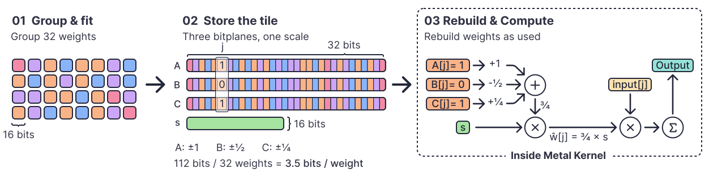
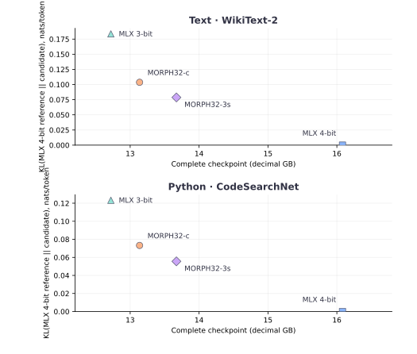

# Metal Orbit-Recurrent Packed Hypercode (MORPH-32)

MORPH-32 reduces the size of Qwen3.8-27B by 15–18% compared with MLX 4-bit while staying within 0.44–1.58 percentage points on the measured MMLU questions. Both MORPH profiles also perform better than MLX 3-bit on the reported text, code, MMLU and HumanEval tests, although MLX 3-bit is smaller and faster.

MORPH means **Metal Orbit-Recurrent Packed Hypercode**. Metal is the Apple GPU runtime; Orbit-Recurrent describes how the compact layout rotates and reuses stored bits; Packed Hypercode is the small recipe stored for each group of 32 weights. Three sign patterns and one shared scale approximate those weights. MORPH32-c stores only half of the third pattern and rebuilds the rest with rotation and XOR as the model runs. MORPH32-3s stores all three patterns for a simpler option.

[Paper](paper/morph32.pdf) · [Audited results](paper/data/final-summary.json) · [Evidence index](paper/data/research/current-20260911/checkpoint-index.json)

## Two tile layouts

### MORPH32-c · coupled planes



Stores two 32-bit sign planes, half of a third, and an FP16 scale. Rotation and XOR rebuild the missing bits when the Metal kernel uses the weights: **96 bits per compact tile**.

### MORPH32-3s · independent planes



Stores three full sign planes and an FP16 scale: **112 bits per tile**. No rotation or XOR is needed. The deployed MORPH32-c checkpoint mixes compact and full tiles.

## Measured model comparison

Qwen3.8-27B on Apple M5 Pro. The four rows use the same evaluation inputs; MLX 3-bit quantizes a broader set of tensors.

<!-- RESULTS:START -->

| Model | File GB | Resident GB | Text PPL ↓ | Code PPL ↓ | MMLU ↑ | HumanEval ↑ | Gen. tok/s ↑ |
|---|---:|---:|---:|---:|---:|---:|---:|
| MLX 4-bit | 16.08 | 15.13 | 4.756 | 2.838 | 84.04% | 76.83% | 15.92 |
| MORPH32-c | 13.14 | 12.19 | 4.990 | 2.971 | 82.46% | 70.12% | 13.35 |
| MORPH32-3s | 13.67 | 12.72 | 4.920 | 2.915 | 83.60% | 70.12% | 14.64 |
| MLX 3-bit | 12.72 | 11.77 | 5.217 | 3.037 | 78.60% | 64.02% | 22.26 |

<!-- RESULTS:END -->

GB is decimal. MMLU is a fixed 1,140-question subset; HumanEval has 164 tasks. Generation is the median of ten 4,096-prompt/64-output-token runs. See the [paper](paper/morph32.pdf) for the method, additional metrics, and limitations.

### Model size versus prediction divergence



Each point is one measured model. Lower KL means its predictions are closer to MLX 4-bit on the same text or Python inputs; the horizontal axis is the complete model file size. These four points do not imply a continuous tradeoff curve.

## Rebuild the evidence without inference

```bash
uv sync --locked --dev
uv run python paper/artifact.py
```

This command audits saved records, rebuilds the numerical summaries, and refreshes the README results table. The two diagrams and size versus KL figure are versioned SVG files. The Typst paper reads the audited JSON directly. It does not load models, run benchmarks, execute generated code, or create a PDF. [The artifact verification record](paper/data/artifact-verification.json) lists the source hashes and scope of the checks.

The [frozen protocol and amendments](paper/data/research/current-20260911/protocol.json) record model revisions, dataset inputs and the HumanEval export correction. MLX's streaming decoder dropped an initial space; exact decoding of the saved tokens restored Python indentation uniformly for every configuration. Original exports, corrected exports and official harness results are all preserved. No inference was repeated for that correction.

## Hardware and scope

This implementation requires Apple M5 and working MLX Metal support. The prefill kernel uses private MLX NAX helpers, so dependencies are pinned. M1–M4, other accelerators and broad model-family compatibility are not validated. The smaller-model study is a limited generalization check, not a claim of general quality preservation. BF16 is the conversion source, but MLX 4-bit is the evaluation reference.

## Build your checkpoints

Run commands from the repository root. Install [uv](https://docs.astral.sh/uv/getting-started/installation/), then download the exact source revisions. Conversion needs both MLX 4-bit and BF16 snapshots; inference needs only the resulting `.morph` file. Allow roughly 130 GB free disk space for sources, both outputs and working room. Conversion memory and duration are not characterized by the inference table.

```bash
uv sync --locked --dev

uv run hf download mlx-community/Qwen3.8-27B-4bit \
  --revision 3e6447f082e89cc7f0bc6e5441afd38dfce760ff \
  --local-dir models/Qwen3.8-27B-4bit
uv run hf download Qwen/Qwen3.8-27B \
  --revision 1d4bf0f2ff6012fd82039f2fa52739d0dd7c60c0 \
  --local-dir models/Qwen3.8-27B-BF16

uv run morph32 calibrate --source models/Qwen3.8-27B-4bit \
  --output results/calibration.safetensors

for profile in morph32-3s morph32-c; do
  uv run morph32 convert \
    --source models/Qwen3.8-27B-4bit --bf16 models/Qwen3.8-27B-BF16 \
    --calibration results/calibration.safetensors --profile "$profile" \
    --output "checkpoints/$profile.morph" \
    --report "results/conversion-$profile.json"
done
```

Calibration uses 128 tokens from the included WikiText-2 validation corpus, beginning at token 32,768. The encoder fits BF16 rows using activation-channel importance, three initial scales and two base seed-bit search sweeps, followed by refinement with two sweeps and three deterministic randomized restarts (seed 2026). It keeps the best candidate using its stored FP16 scale. No training or dataset download is needed beyond the frozen local evaluation data. Conversion refuses to overwrite existing outputs.

```bash
uv run morph32 inspect checkpoints/morph32-c.morph
uv run morph32 generate --checkpoint checkpoints/morph32-c.morph \
  --prompt "Write a Python function that merges overlapping intervals." \
  --max-tokens 256
```

Generation defaults to greedy decoding with `enable_thinking=False`. Loading verifies every tensor's SHA-256 and uses embedded config/tokenizer assets. `.morph` is a safetensors container with a versioned MORPH manifest, not an overlay requiring another checkpoint.

## Chat in OpenCode

Serve the converted checkpoint with a second command:

```bash
uv run morph32 serve --checkpoint checkpoints/morph32-3s.morph --port 8081
```

This starts a local OpenAI-compatible API at `http://127.0.0.1:8081/v1`, with streaming, tool-call parsing and thinking disabled. Add the [OpenCode provider example](docs/opencode.example.json) to your config, then select **MORPH-32 Local / Qwen3.8 27B · morph32-3s**. [Serving instructions](docs/serving.md) cover conversion, limits and shutdown.

## Evidence and implementation

- `src/morph32/`: encoder, container, Metal kernels, runtime and evaluation CLI.
- `paper/data/research/primary-20260911/`: raw quality, timing, capability and profiling records.
- `paper/data/research/smaller-20260911/`: completed smaller-model comparison.
- `paper/data/research/current-20260911/`: protocol, input audits and checkpoint-to-evidence index.
- `paper/publication.py` and `paper/research_artifact.py`: results-table generation and saved-record validation.
- `paper/main.typ`: format, evaluation method and results; `docs/serving.md`: local serving.

Code: [MIT](LICENSE). Model weights and datasets retain their upstream terms.
